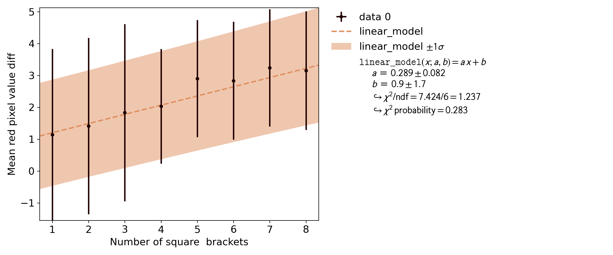
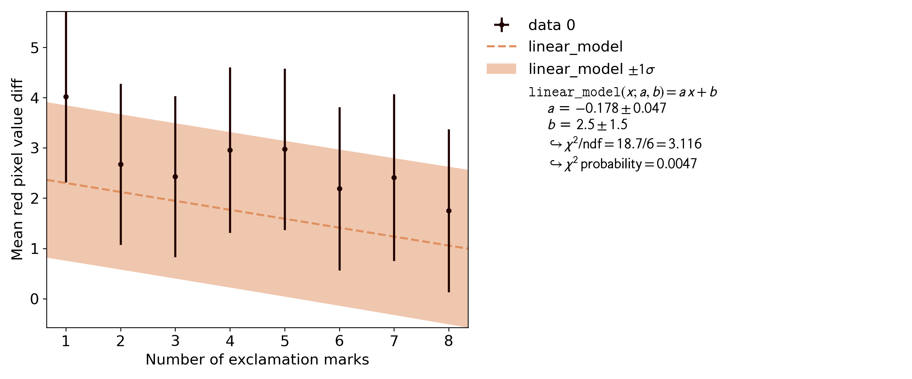

## Emphasis

The files in this directory are concerned with testing ways to (de-)emphasize specific keywors in prompts with Stable Diffusion.
The methodology that was used to create the plots is important.
Please do not repost the plots without linking this page or providing a similarly detailed discussion of the methodology and the results.

The general methodology is as follows:
data is generated for a simple prompt that specifies color, e.g. "Flowers, red, blue".
The prompt is then manipulated in a well-defined way (e.g. "Flowers, [red], blue")
for the same seed and the difference in mean RGB values across the images is calculated.
The range of RGB values shown in the plots is the 8 bit uint format that ranges from 0 to 255.
Note that the results for low-level features like color may not be applicable to higher-level features like the overall content of an image.

Data analysis is performed using [kafe2](https://github.com/PhiLFitters/kafe2),
a framework for likelihood-based parameter estimation using nonlinear regression.
To this end data is transformed into a format that allows for a variation of the strength of any supposed effect,
e.g. the number of square brackets on the x axis and the measured strength of the effect on the y axis.

The distribution of mean RGB values across a set of images is assumed to be normally distributed.
The covariance of the mean can then be assumed to be the covariance of the RGB value distribution divided by the number of samples per data point.
Note: neglecting the covariance/correlation between data points with the same seeds leads to a vast overestimation of the data uncertainties.

Based on the aforementioned means and their covariances a linear regression using the model function `f(x; a, b) = a * x + b` is performed.
Assuming that the model function accurately describes the data this guarantees that the uncertainties on the model parameters are normally distributed.
The value of `chi2/NDF` is considered to evaluate whether the model function significantly deviates from the data.

The CLI functionality of [hlky's webui script](https://github.com/hlky/stable-diffusion-webui) is used for generating the data.

### Square brackets
This test is concerned with the effect of square brackets on keywords if they are not explicitly processed to have a specific effect.
A common assertion is that Stable Diffusion has learned to associate square brackets with emphasizing a keyword.
The test prompts are "Flowers, red, blue", "Flowers, [red], blue", "Flowers, [[red]], blue", and so on.
The seeds 0-59 were used to generate a total of 60 images per data point.

The result of a qauntitative analysis is that square brackets seem to have a small but statistically significant positive effect.
No effect or a negative effect can be excluded with 99.98% confidence.
The usage of four pairs of square brackets increases the average red pixel value of an image by ~1.
While statistically significant this effect is not perceptible to humans.

The value of chi2/NDF is close to 1 which indicates that the assumptions that went into the analysis are valid.

### Exclamation Marks
This test uses the same methodology as the one for square brackets except that exclamation marks are appended instead: "Flowers, red, blue", "Flowers, red!, blue", "Flowers, red!!, blue", and so on.

The value for chi2/NDF is very high.
While this can have multiple reasons the most straightforward interpretation is that adding exclamation marks simply has no coherent effect on the generated images.
And because then the addition of exclamation marks essentially just has an undefined, random effect on the image a first-degree polynomial cannot accurately model this effect, thus resulting in a high value for chi2/NDF.
This interpretation is supported by the implausible fit results:
because the y data is computed as the difference relative to the images that were generated when using no exclamation marks
at all the value for b is expected to be compatible with 0 in the case of a coherent effect (it is not in this case).
